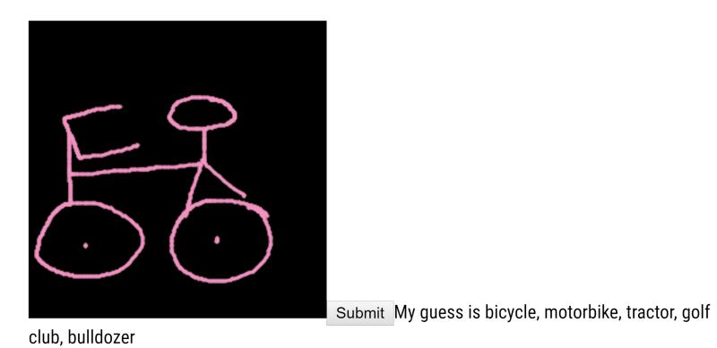
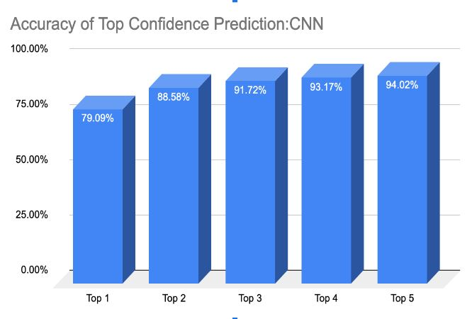

# Introduction
This is a web app for hand drawing recognization. The training data we use for the machine learning model is from [Google QuickDraw Dataset](https://github.com/googlecreativelab/quickdraw-dataset). The source code repository is on [Github](https://github.com/imyanyijie/539Project)

# Purpose
Neural network is a very popular topic in machine learning. We as a team are very interested in learning about neural network and use the knowledge and apply it to real applications. Our goal of this project is to build a tool will detect someone’s hand drawing and try to provide the name of the object. Our application can expand the range of transcription service to hand drawing and also be very useful for early childhood education.
We use the data provided by Google QuickDraw project to train our CNN+RNN model in order to recognize the handdrawn object.

# Take Away
+ Use Python django APIs to separate business logic and web service, and facilitate the collaboration among team members.
+ CNN model was able to reach 79% accuracy after 8 epochs.
+ CNN+RNN model was able to reach 74% accuracy after 3 epochs.
+ CNN+RNN model was able to reach a simular accuracy with less epochs.
+ CNN+RNN reached higher accuracy with less epoch compare to RNN

Web app:



CNN Top 5:



CNN Confusion Matrix:


#Initial Setup For FrontEnd
npm is required for building the FrontEnd
```
cd ML_django/frontend/
npm install
npm run build
```
React is also require for the frontend to build
```
npm install react react-dom --save
```
Pytorch is require to use the model for the frontend (If the environment is different, please reference pytorch website: [Pytorch](https://pytorch.org/get-started/locally/))
For linux environment: 
```
conda install pytorch torchvision cudatoolkit=10.1 -c pytorch
```
Apex is also required
```
git clone https://github.com/NVIDIA/apex
cd apex
pip install -v --no-cache-dir --global-option="--cpp_ext" --global-option="--cuda_ext" ./
```
To run the FrontEnd service
```
python manage.py runserver locoalhost:8000
```
#Initlial Setup for CNN/CNN+RNN Environment 

Pytorch is require to use the model for the frontend (If the environment is different, please reference pytorch website: [Pytorch](https://pytorch.org/get-started/locally/))
For linux environment: 
```
conda install pytorch torchvision cudatoolkit=10.1 -c pytorch
```
Apex is also required
```
git clone https://github.com/NVIDIA/apex
cd apex
pip install -v --no-cache-dir --global-option="--cpp_ext" --global-option="--cuda_ext" ./
```


